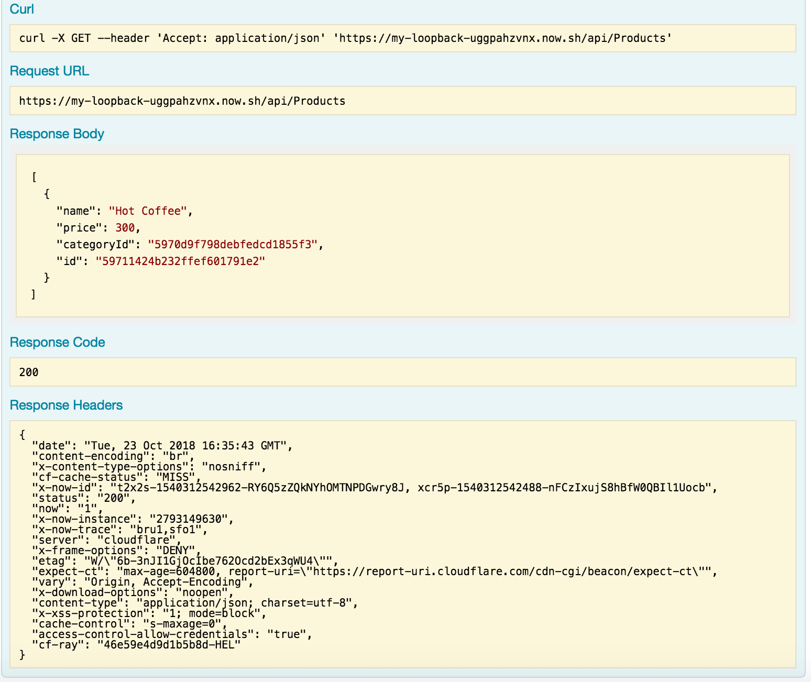

# REST API in Loopback framework

[LoopBack - Nodejs framework](http://loopback.io).

## Live demo

https://my-loopback-uggpahzvnx.now.sh/explorer

## Features:

* Basic server Rest Api that has user, category, and product route

* Includes authenticate route with token and public route

* Remote MongoDB at mLab

* Unit testing using Mocha and Chai, with local collection

* Live demo at [Now - a Global Serverless](https://zeit.co/now) https://my-loopback-uggpahzvnx.now.sh/explorer

### Main view of the app:

### Sub routes

### API responses
